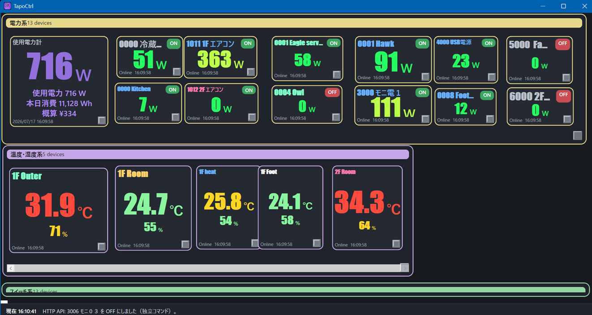

# TapoCtrl

**English** | [日本語](README.md)

TapoCtrl is a Windows WPF desktop application for monitoring and controlling TP-Link Tapo devices. It presents power, temperature, humidity, and switch states in customizable panels and graphs, with controls available from the desktop, system tray, and a local web interface.

Current version: **v0.1.01**

## Main panel



## Features

- Discovers Tapo devices on the LAN and polls their state
- Displays power, temperature, humidity, and on/off status
- Individual and multi-series graphs with date selection, energy totals, and estimated electricity cost
- Customizable tabs, panel positions, sizes, and colors
- Power control from the system tray and mini panel
- Separate view and control web dashboards, plus JSON and power-control APIs
- Retains the last successful snapshot during temporary connection failures

## Requirements

- Windows 10/11 x64
- Python 3
- Python packages: `python-kasa` and `tapo`
- To build from source: .NET 8 SDK or later

## Installation

### Use a release build

Download the latest ZIP from [Releases](../../releases), extract it, and run `TapoCtrl.exe`. The application binary includes the .NET runtime, but Python 3 is still required for Tapo communication.

If the Python packages are missing, the application can guide you through their installation. To install them manually:

```powershell
python -m pip install --user --upgrade python-kasa tapo
```

### Build from source

```powershell
git clone https://github.com/cyfomix-ui/TapoCtrl.git
cd TapoCtrl
.\Build.ps1
```

To produce a self-contained single-file executable:

```powershell
.\Build.ps1 -Publish
```

The output is written to `TapoCtrl\bin\Release\net8.0-windows\win-x64\publish`.

## Initial setup

1. Install Python 3 and the required packages.
2. Enter your TP-Link ID (email address) and password in TapoCtrl settings.
3. If necessary, specify hub IP addresses and the Python executable path.
4. After device discovery, adjust the panel layout and polling intervals.

Credentials are encrypted for the current Windows user with DPAPI and stored in `%LOCALAPPDATA%\TapoCtrl\credentials.bin`. They are not written to the repository or the settings JSON file.

## Web interface and API

The default port is `8080`.

- Control dashboard: `http://127.0.0.1:8080/Ctrl/`
- View-only dashboard: `http://127.0.0.1:8080/View/`
- Device JSON: `http://127.0.0.1:8080/api/devices`
- Local integration power control: `POST /api/power?id=device-id-or-exact-name&state=on|off`
- Direct IP: `POST /api/power?ip=192.168.1.50&state=on|off`

### Security notice

The HTTP service does not provide user authentication. `/api/power` accepts loopback clients only; use `/Ctrl/` for power control from another LAN, Tailscale, or mobile device. Any client that can reach `/Ctrl/` can operate Tapo switches. When binding to `0.0.0.0`, limit access to a trusted LAN or Tailscale network. Do not expose the service directly to the internet through router port forwarding.

If a Windows Firewall inbound rule is required, run the following command from an elevated PowerShell session:

```powershell
.\Allow_TapoCtrl_WebServer_Firewall.ps1
```

## Local data

Settings, history, credentials, and operation logs are stored under `%LOCALAPPDATA%\TapoCtrl`. Local application data is excluded from Git.

- Daily logs: `%LOCALAPPDATA%\TapoCtrl\logs\TapoCtrl_YYYYMMDD.log`
- Weekly archives: `%LOCALAPPDATA%\TapoCtrl\logs\archive\`

Logging, the minimum log level, and verbose function-entry logging can be configured in Settings. Use `Trace` only for troubleshooting because it produces high-volume output.

## Changes in v0.1.01

- Adds historical date selection to individual and multi-series graphs, including an aggregate power series and daily/monthly energy and estimated-cost statistics
- Uses stable device-ID-based colors consistently for device names and graphs in both the desktop and web interfaces
- Splits the web dashboard into `/Ctrl/` and `/View/`, and adds selectable mini graphs for up to four devices with current values, timestamps, and offline/stale status
- Improves graph error reporting, collapsible device groups, power summaries, and delayed-reading indicators
- Hardens local power-control target matching and restricts the integration API to loopback clients

## Notes

- Device support may vary with the Tapo model, firmware, and versions of `python-kasa` and `tapo`.
- Use power-control and LAN-exposure features only on networks and devices you are authorized to manage.
- This repository currently has no explicit license.
